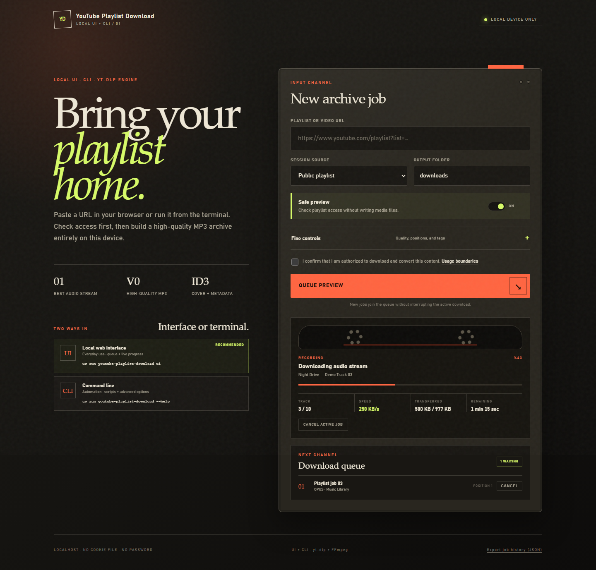
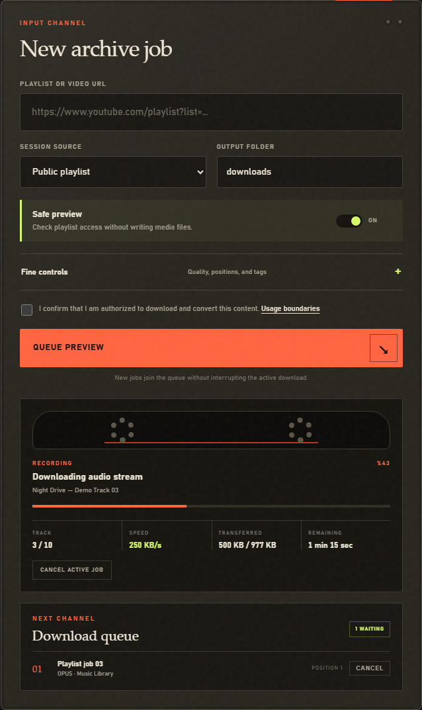
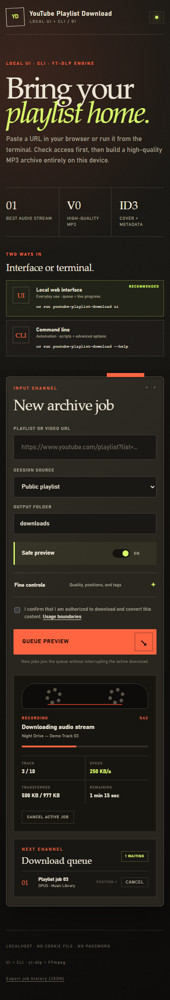

# YouTube Playlist Download

A lightweight localhost web UI and CLI powered by
[`yt-dlp`](https://github.com/yt-dlp/yt-dlp) for archiving YouTube videos and
playlists you own or have permission to download as high-quality MP3 files.

> [!IMPORTANT]
> This project is not designed to bypass copyright or YouTube restrictions.
> Use it only for content you own, have permission from the rights holder to
> download, or may lawfully download under applicable law.

## See it in action



<p align="center">
  
  
</p>

## Lightweight local interface

Start it with one command after setup:

```powershell
uv run youtube-playlist-download ui
```

Your browser opens at `http://127.0.0.1:8765`. Paste a URL, select a browser
session only when private access is required, and run the safe preview first.
You do not need to use the CLI for everyday work. The CLI remains available for
automation and advanced workflows. New playlists can be queued while a download
is active, with live speed, transferred size, track position, and ETA updates.

## Why localhost?

Private playlist access may require cookies from a browser where you are already
signed in. The UI binds only to `127.0.0.1`; your Google session stays on your
device and is never stored on a remote server. The project does not export or
write browser cookies to disk.

## Features

- Public, unlisted, and authorized private playlist support
- Lightweight localhost web UI with no frontend framework
- FIFO queue that accepts new playlists during an active download, with
  queued and active-job cancellation plus same-session retry
- Queue and recent history persisted to disk and restored on restart
- Live KB/s, transferred size, track count, overall progress, and ETA
- Best available audio stream converted to MP3, M4A, or Opus
- Highest FFmpeg VBR quality (`0`) by default
- Embedded thumbnail and media metadata
- Playlist order preserved in folder and file names
- Download archive that prevents accidental duplicates
- Safe preview (`--dry-run`) and dependency diagnostics (`doctor`)
- Clear setup status in the UI before a preview or download starts
- Optional config file for repeated CLI/UI defaults
- Downloadable job-history export (JSON)
- No password or cookie-file input

## Quick start

Requirements:

- Python 3.11+
- [FFmpeg](https://ffmpeg.org/download.html)
- [Deno 2.3+](https://docs.deno.com/runtime/getting_started/installation/)
  (recommended) or Node.js 22+
- [uv](https://docs.astral.sh/uv/) for reproducible setup

```powershell
winget install Gyan.FFmpeg
winget install DenoLand.Deno
git clone https://github.com/tahsinsoyak/youtube-playlist-download.git
cd youtube-playlist-download
uv sync --locked
uv run youtube-playlist-download doctor
uv run youtube-playlist-download ui
```

The repository uses a tested, locked yt-dlp release. Dependabot checks for
stable yt-dlp updates daily and opens a pull request that must pass the test
suite before it is merged. To update a local checkout immediately:

```powershell
uv lock --upgrade-package yt-dlp
uv sync --locked
```

If the browser does not open automatically, visit `http://127.0.0.1:8765`.

Preview a public playlist from the CLI:

```powershell
uv run youtube-playlist-download download "PLAYLIST_URL" --dry-run --confirm-rights
```

Download a public playlist:

```powershell
uv run youtube-playlist-download download "PLAYLIST_URL" --confirm-rights
```

Download an authorized private playlist after signing in to the correct YouTube
account in Firefox:

```powershell
uv run youtube-playlist-download download "PLAYLIST_URL" `
  --browser firefox `
  --confirm-rights
```

Files are written to `downloads/<playlist title>/` by default.

The legacy `playlist-audio` command remains available for compatibility. New
documentation uses `youtube-playlist-download`, matching the repository name.

## Documentation

- [Usage and CLI options](docs/usage.md)
- [Local web interface](docs/web-ui.md)
- [Private playlist access](docs/private-playlists.md)
- [Audio quality and file format](docs/audio-quality.md)
- [Troubleshooting](docs/troubleshooting.md)
- [Legal and ethical boundaries](docs/legal-and-ethics.md)
- [Architecture and development](docs/architecture.md)

## Project status

The CLI and localhost web UI are both supported. The queue and recent job
history are saved to `~/.playlist-audio/queue-state.json` and restored on
the next start; a job that was still downloading when the app closed is
marked interrupted rather than resumed. Completed files and the download
archive remain on disk.

## License

This project's source code is available under the [MIT License](LICENSE).
`yt-dlp`, FFmpeg, and other dependencies retain their own licenses.
